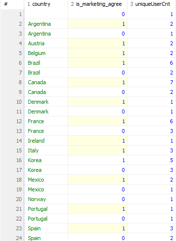

# Grouping

## 데이터를 계산하는 함수

- 합계, 평균, 갯수 카운팅 같은 작업
- 문자열을 자라내거나, 대/소문자 변경하는 등의 함수

1. 집계 함수 : 합 / 평균 / 개수 세기 etc
2. 일반 함수 : 문자열 slicing / 대소문자 변경 등

### GROUP BY

- 전체 데이터에 함수를 적용하기도 하지만, 그룹별로 수치를 도출하는 경우 사용하는 함수
- 그룹별로 집계함수를 적용하기 위해 데이터를 나눈다
  - '국가별 회원 수를 집계 해라'
  - '일별 매출을 계산하라.'
    등의 그룹화 기준으로 지정하여 계산 수행이 가능하다.

### HAVING

- GROUP BY는 그룹핑을 하는데. 여기서 추가로 계산한 결과를 다시 필터링 하는 절이다.
- 예로 '국가별 회원수를 계산하고, 회원수가 10명이상인 국가만 추출' 등
- 추가적인 조건을 걸기 위해서는 그룹화 이후에 조건을 설정해야 한다. 즉, 집계함수로 계산한 결과중에 조건에 맞는 데이터를 걸어야 한다.
- 이상에서 중요한것은 WHERE은 table 자체이 걸리는 조건이기 때문에 집계함수 이전에 사용이 불가능 하다는 점이다.

### 집계함수

- 다수의 행을 데이터로 하나의 결과값을 집계하는 함수
- 집계함수는 _SELECT_ 문에서만 사용이 가능하다.
- COUNT() 함수는 주어진 컬럼의 값이 NULL이 아닌 행의 개수를 반환한다.
- DISTINCT : 중복 제거 함수이다.
- MIN() : 최저값 출력 함수이다.
- MAX() : 최대값 출력 함수이다.
- SUM() : 합계 구하는 함수이다.
- AVG() : 평균 구하는 함수이다.

### 일반함수

- 하나의 행의 데이터를 가공하여 하나의 결과값을 반환하는 함수.
- ROUND(데이터, 소수점 표기자리) : 결과값을 소수점 표기자리까지 반올림 하는 함수.
- SUBSTR(컬럼명, 시작접, 종료점) : 컬럼명에서 시작점을 기준으로 종료값까지의 데이터를 잘라내서 return (주의사항으로 시작점은 1이다.)
- LENGTH() : 문자열의 길이를 추출하는 함수이다. DB에 따라 LEN()을 쓰기도 한다.
- UPPER() : 알파벳 문자열을 대문자로 변경
- LOWER() : 알파벳 문자열을 소문자로 변경

#### 예제

1. 회원 정보 테이블 users에서 존재하는 국가를 세는 SQL문

   ```sql
   SELECT COUNT(*) FROM users;
   SELECT COUNT(country) FROM users;
   SELECT COUNT(DISTINCT country) FROM users;
   ```

2. 제품 정보 테이블 products에서 최저가를 출력

   ```sql
   SELECT MIN(price) FROM products;
   ```

3. 제품정보 테이블에서 정상가격 기준으로 최고가를 출력

   ```sql
   SELECT MAX(price) FROM products;
   ```

4. 제품정보 테이블에서 정상 가격의 합계를 출력

   ```sql
   SELECT SUM(price) FROM products;
   ```

5. 제품 정보테이블에서 discount_price평균

   ```sql
   SELECT AVG(discount_price) FROM products;
   SELECT ROUND(AVG(discount_price),2) FROM products;
   ```

6. users에서 가입일 / 가입연원 / 가입일시 추춘

   ```sql
   SELECT SUBSTR(created_at, 1, 10) as day, SUBSTR(created_at, 1, 7) as month FROM users;
   ```

7. users에서 이메일문자열의 길이 추출
   ```sql
   SELECT LENGTH(username),username FROM users;
   ```

## 연습문제

1. products 에서 정상 가격을 모두 더한 값을 구하시오.(단, 소숫점 둘째짜리 까지 표기)

```sql
SELECT ROUND(SUM(price),2) AS sumPrice FROM products;
```

2. products 에서 id가 30이하인 제품의 정상가격의 평균을 구하시오 (단, 소숫점 둘째짜리 까지 표기)

```sql
SELECT ROUND(AVG(price),2) AS avgPrice FROM products WHERE id <= 30;
```

3. users에서 가입일시가 2010-10 부터 2010-12까지인 회원 아이디를 중복 없이 센 값을 출력하시오.

```sql
SELECT COUNT(created_at) AS cntCreate FROM users WHERE SUBSTR(created_at, 1, 7) BETWEEN '2010-10' AND '2010-12';
```

4. users에서 이메일의 길이가 17자리 이하인 회원 수를 중복 없이 센 값을 출력하시오

```sql
SELECT COUNT(username) AS cntUsername FROM users WHERE LENGTH(username) <= 17;
```

## GROUP BY

- 어떤 기준으로 묶어서 '계산'인지에 가깝다.
- 집계함수만으로 원하는 결과를 얻을 수 없을 때가 있다. 데이터 전체가 아니라 원하는 기준으로 그룹을 나눠 계산할 일이 있기 때문에. 예를 들어서 전체 외원 수가 아닌 국가별 회원 수를 나누어 계산하기도 하며, 월별로 가입한 회원수를 집계하기도 합니다.

예제 : 국가 별 회원 수를 추출

```sql
SELECT country, COUNT(country) AS cntCountry FROM users GROUP BY country;
```

- GROUP BY는 집계함수와 함계 사용되며, GROUP BY 기준 컬럼은 SELECT에서 집계 함수를 사용할 때 묶어서 계산을 수행하는 _기준_ 이 된다.
- 그룹으로 나뉜 결과에 따라 집계 함수가 적용되어 결과를 출력
-

예제 : users에서 country가 Korea인 회원중 마케팅 수신 동의한 회원수를 추출하시오

```sql
SELECT country, COUNT(country) AS cntCountry FROM users WHERE is_marketing_agree = 1 AND country = 'korea';
```

- 이렇게 작성을 하게 되면 나라가 변경 되었을 때 찾기 귀찮다.

예제 : 국가별 마케팅 수신 동의 회원 수 확인

```sql
SELECT country, is_marketing_agree, COUNT(DISTINCT id) AS uniqueUserCnt
	FROM users
	GROUP BY country, is_marketing_agree
	ORDER BY country, is_marketing_agree DESC;
```



country를 먼저 그룹으로 묶고 그 후 is_marketing_agree를 기준으로 그룹을 하여 분류 되었다.

users 국가 내 도시별 회원 수 추출 (국가명 기준 알파벳 순으로 정렬, 같은 국가 내에서는 회원 수 기준 내림차순으로 정령할 껏)

- 차원(dimension) : 분석 시에 지표를 그룹으로 묶는 기준
- 매트릭(metric) : 각 차원에 대한 연산을 수행할 때 적용하는 계산식

이상의 쿼리문에서 차원은 country / city에 해당하고 metric은 COUNT()에 해당한다.

예 - users에서 월별 가입 회원수를 추출

```sql
SELECT created_at AS month , COUNT(DISTINCT id) AS userCnt
	FROM users
	GROUP BY SUBSTR(created_at, 1, 7)
	ORDER BY month DESC;
```

차원 -> 연월
매트릭 -> 회원수

### GROUP BY 요약

1. GROUP BY는 그룹별로 수치를 계산할 때 사용. 쉼표(,)를 써서 그룹화 기준을 복수로 지정 가능하다.
   - 두개 이상의 기준을 지정할 때 컬럼 순서에 따라 그룹의 층위가 정해지므로 순서를 명확하게 지정해야한다.

- 참조 : GROUP BY를 쓸 때에는 GROUP BY에 적은 컬럼을 기준으로 SELECT에도 동일한 순서로 적어 계산된 수치의 기준을 알려주면 시인성이 더 좋아진다.
- 한마디로 SELECT문에서 작성을 할 때 'SELECT 차원1, 차원2, 연산1, 연산2' 같은 형식으로 작성을 하면 된다.

연습 문제

1. OREDERDETAILS 에서 주문 아이디 별 주문 수량의 총합을 출력 ( 총합은 내림차순으로)

```sql
SELECT order_id , SUM(quantity) AS sumQuan
	FROM orderdetails
	GROUP BY order_id
	ORDER BY sumQuan DESC;
```

2. orders에서 지원 아이디 별, 회원 아이디 별로 주문 건수를 출력할 것 ( 단, 직원 아이디 기준 오름 차순으로 먼저 정렬한 뒤, 주문 건수 기준 내림 차순을 정렬)

```sql
SELECT staff_id, user_id, COUNT(user_id) AS orderCnt
	FROM orders
	GROUP BY staff_id, user_id
	ORDER BY staff_id, orderCnt DESC;
```

3. orders에서 월별로 주문한 회원 수를 출력 (주문일자 컬럼을 활용 최신순으로 정렬)

```sql
SELECT SUBSTR(order_date, 1, 7) AS MONTH, COUNT(DISTINCT user_id) AS userCnt
	FROM orders
	GROUP BY MONTH
	ORDER BY MONTH desc;
```

## HAVING

- 집계 값을 다시 필터링 하는 HAVING
- GROUP BY절을 이용하여 값을 그룹하여 집계 하였다, 여기서 특정 조건을 추가하여 나온 값을 다시 필터링을 하는 것이 HAVING 절이다.

예시로 국가별 회원수가 n명 이상인 국가의 회원 수만 보기 위해서는,

1. 집계 함수를 사용하여 그룹핑을 진행한다.
2. 그룹핑의 결과을 조건을 걸어야 한다.

users에서 country가 Korea / USA / France인 회원 수를 국가별로 출력하시오.

```sql
SELECT country , COUNT(DISTINCT id) AS userCnt FROM users GROUP BY country HAVING country IN ('Korea', 'USA','France')
```

3개국에 해당하는 구각의 회원 수 말고, 회원수가 8명 이상인 국가의 회원수를 출력

```sql
SELECT country , COUNT(DISTINCT id) AS userCnt FROM users GROUP BY country HAVING userCnt > 7 ORDER BY userCnt DESC;
```

orders 담당 직원별 주문 건수와 주문 회원수를 계산하고, 주문 건수가 10건 이상 이면서 주문 회원수가 40명 이하인 데이터만 출력 (단, 주문 건순 기준 내림차순으로 정렬)

```sql
SELECT staff_id, COUNT(order_date) AS orderCnt, COUNT(DISTINCT user_id) AS userCnt
	FROM orders
	GROUP BY staff_id
	HAVING orderCnt >= 10 AND userCnt <= 40
	ORDER BY orderCnt DESC;
```

### HAVING 요약

- GROUP BY와 집계함수를 이용해서 그룹별로 집계한 값을 필터링 할 때 사용한다.

1. HAVING은 WHERE 처럼 필터링 기능을 수행 하지만 적용영역이 다르다. WHERE 절은 FROM절에서 불러온 값을 필터링 하고, HAVING절은 GROUP BY한 집계함수 절에서 사용된다.
2. HAVING은 조건 연산자로 여러 조건문을 연결할 수 있으며, 연산이 적용되지 않는 기본 컬럼은 HAVING을 사용할 수 없다.

연습문제

1. orders에서 회원별 주문 건수를 추출 (단, 주문 건수가 7건 이상인 회원 정보만 추출하고, 주문 건수 기준으로 내림 차순 정렬할 것.)
2. users에서 국가별 도시 수와 국가별 회원 수를 추출하시오(단, 도시 수가 5개 이상이고 회원수가 3명 이상인 정보만 추출하고, 도시수, 회원수 모두 내림차순 정렬)
3. users에서 이하의 국가에 거주중인 회원 수를 국가별로 추출 할 것(단, 회원 수가 5명 이상인 국가만 추출하고, 회원수 기준 내림 차순 정렬)

```sql
SELECT user_id, COUNT(order_date) AS orderCnt
	FROM orders
	GROUP BY user_id
	HAVING orderCnt > 6
	ORDER BY orderCnt DESC;
SELECT country, COUNT(DISTINCT city) cityCnt, COUNT(id) AS userCnt
	FROM users
	GROUP BY country
	HAVING cityCnt > 4 AND userCnt >2
	ORDER BY cityCnt DESC, userCnt desc;
SELECT country, COUNT(id) AS userCnt
	FROM users
	WHERE country IN ('USA', 'Brazil', 'Korea', 'Argentina', 'Mexico')
	GROUP BY country
	HAVING userCnt > 4
	ORDER BY userCnt DESC;
```

## JOIN / UNION

- JOIN : 테이블을 좌우로 결합
- UNION : 테이블을 상하로 결합

SQL에서 데이터를 다루다 보면 여러 테이블에 나뉘어 있는 데이터를 하나로 모아서 봐야하는 경우가 생깁니다. 즉, 테이블들을 미리 다 찢어 놨다는 의미입니다. 특정 정보를 보기 위해서 다양한 테이블을 합치는과정이 필요한데, 이를 다 분할해둔 이유는 관계형 데이터 베이스에서는 데이터의 중복을 피하고 쉽게 관리하기 위해서 데이터를 여러 곳에 나누어 보관합니다.

- 이상의 원칙을 _정규화(Data Normalization)_ 이라고 합니다. 1 ~ 6 정규화 까지 있긴 한데 실무에서는 약 3 정규화 정도 까지만 구현함을 원칙으로 합니다.

## JOIN

주문 정보 테이블인 orders와 직원 정보 테이블 staff를 합친다고 가정 했을 때 두 테이블을 합칠 때에는 공통된 부분이 있어야 합니다. JOIN은 두 테이블의 컬럼 구성이 달라도 결합이 가능하며, 합친 테이블의 컬럼수는 늘어 납니다.

같은 테이블끼리의 JOIN을 수행하더라도 선택하는 JOIN 유형에 따라 다른 결과값이 나오게 됩니다. 그런데, 뭐가 됐든 결합을 위한 공통 분모인 Key가 존재하고, 이것이 PK / FK이다.

## UNION

얘는 칼럼의 구성이 같은 두 쿼리 결과 집합을 상하로 결합합니다. 그래서 결과는 '결합 전의 컬럼 구성과 같습니다.' 그렇기 때문에 결합 대상인 두 쿼의 결과 집합은 컬럼 순서와 개수가 같아야 합니다.

## SubQuery

데이터가 저장된 상태 그대로 쿼리를 수행하기도 하지만, 쿼리를 수행한 결과를 값이나 조건으로 하여 다시 쿼리를 수행하는 경우도 있습니다. 즉, 쿼리 속의 쿼리를 사용하는데, 이를 서브 쿼리라고 합니다.

## JOIN

### 테이블의 좌우 결합

- 복수의 테이블을 이용하여 필요한 데이터를 취합할 수 있다.
- 집합의 결합 조건은

```sql
SELECT * FROM users u INNER JOIN orders o ON u.id = o.user_id;
```

이상의 쿼리문을 실행 했을 때 users 테이블과 orders 테이블의 정보가 모두 출려된다.
FROM까지는 동일해 보이는데, users 다음에 앞으로 users 테이블의 정보를 편하게 불러오기 위해 테이블 별칭을 u로 정했다는 부분을 확인할 수 있다. 그리고 JOIN유형을 INNER JOIN으로 선택하고, 합쳐질 테이블인 orders 역시 추후 공통된 부분과의 연산을 위하여 o라는 별칭으로 지정했다.

다음에 테이블 명 뒤에 AS 안 붙었는데 왜 테이블 축약어가 지정되는 문제가 있는데 이는 AS가 컬럼명을 지을때 사용하기 때문에 생략되어도 무방하다.

정리 하자면, 두 테이블을 하나로 결합 하려면 두 테이블에 공통된 부분이 존재해야하며, 관계형 데이터베이스에서는 이 부분을 키(Key)라고 합니다. 그래서 관계형 데이터베이스에서는 키 값이 테이블에 반드시 한 개 이상 존재하도록 설계되어있고, 테이블에서 개별 행을 '유일하게 구분' 짓습니다. 따라서 키 값은 컬럼내에서 중복되지 않으며 다른 개별 행을 구분해야 하므로 null값을 가질 수도 없다.

- 참조 : 키 값은 테이블 내에서 고유한 값을 가지므로 한 테이블에서 개수를 계산할 때 중복되지 않습니다. 그런데 여러 테이블을 조인하면 키값도 중복 될 수 있습니다. 예를 들어 회원 아이디가 7인 사람이 세 번 주문 했다면, 회원 정보와 주문 정보를 결합한 테이블에서는 회원 아이디가 7인 row가 3개 있을 겂니다. 이때 '한 번이라도 주문한 회원 수'를 중복없이 구하려면 결국에서 DISTINCT가 요구된다.

users에 있는 id는 PK에 해당하고, orders에 있는 user_id는 FK에 해당합니다. 즉, PK와 FK의 결합을 통해서 JOIN이 이루어진다.
논리적으로 FK는 중복이 가능하다. -> 외래키는 말그대로 외부의 테이블을 참조하기 때문에 가져와서 특정 키의 값을 저장한다고 생각하면 된다.

### INNER JOIN

- 두 테이블이 키 값이 일치하는 행만 가져오는 JOIN -> 집합에서의 교집합이다.

### LEFT JOIN

예제 : users와 orders를 하나로 겹합하여 출력할 것( 주문정보가 없는 회원의 정보도 출력할 것)

```sql
SELECT * FROM users u LEFT JOIN orders o ON u.id = o.user_id ORDER BY u.id;
```

OUTER는 생략가능

```sql
SELECT *
  FROM users u
   LEFT OUTER JOIN orders o
   ON u.id = o.user_id
  ORDER BY u.id;
```

INNER JOIN과 유사하게 테이블 두 개가 합쳐지기는 했습니다. INNER JOIN이 두개의 집합에서 교집합 부분만 추출하는 반명에, LEFT JOIN은 먼접 언급되 테이블의 전체 정보는 다 출력하고 그 중에서 후에 오는 테이블과 일치하는 것들만 따로 더 가지고 오는 형태라고 할 수 있습니다.

이 두개가 실무에서 가장 자주 쓰인다.

하지만 주문 내역만 명확하게 보고싶다면 INNER JOIN일 쓰겠죠

형식
`FROM 테이블1 a (LEFT/INNER) JOIN 테이블2 b ON a.PK = b.FK;`

---

```sql
SELECT * FROM users u LEFT JOIN orders o ON u.id = o.user_id WHERE o.id IS NULL ORDER BY u.id;
```

처음 배우는 개념 IS입니다. 프로그래밍 언어에서 배웠을때는 == null을 위주로 썼을때 ==에 해당한다고 봐도 된다.

연습문제:
users와 orders 테이블을 하나로 결합하고, 추가로 orderdetails에 있는 데이터도 출력할 것

```sql
SELECT *
	FROM (users u LEFT JOIN orders o ON u.id = o.user_id)
	LEFT JOIN orderdetails od ON o.id = od.order_id
	ORDER BY u.id;
```

이상에서 중요한 것은 기본적으로 SELECT \* FROM users / orders / orderdetail를 수행해서 특정 테이블으 ㅣ어느 컬럼이 다른 테이블의 컬럼과 일치하는지 여부를 찾는 일이 되겠습니다.
users 테이블이 기준이 됩니다.
그리고 otders 테이블에는 user_id 컬럼이 있죠.
근데 orderdetails 테이블에는 order_id가 있습니다.
그러면 그 결과 users + orders 테이블 연산을 할 때는 users의 id를 나타내는 u.id와 o.user_id를 공통점으로 JOIN을 수행하고, 그 연산 결과를 기준으로
공통적으로 존재하는 order 테이블의 id를 나타내는 o.id 와 od.order_id로 JOIN을 수행하게 된다.
